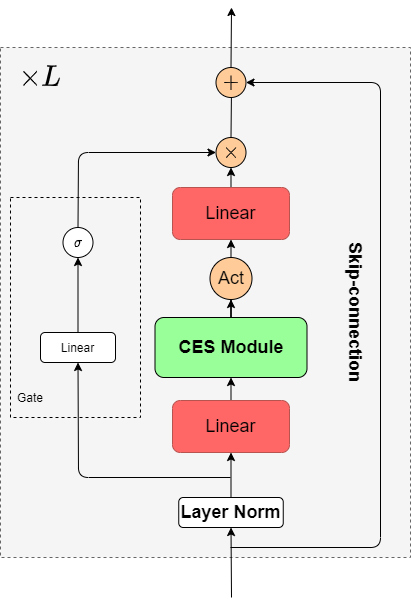

# ETSMLP
This repository provides the implementation for the paper "Incorporating Exponential Smoothing into MLP: a Simple but Effective Sequence Model".



The core code of CETS module is [smlp_module.py](module/smlp_module.py)

##Requirement
- Python version >=3.6
- Pytorch version >=1.9.0
- [Fairseq](https://github.com/facebookresearch/fairseq) version  >= 0.10.1

##Dataset Download
Downloading the raw data of LRA should follow the instruction of [Mega](https://github.com/facebookresearch/mega/blob/main/examples/mega/README.lra.md)
Downloading the raw data of CoLa,SST-2, IMDB, QQP, MRPC, MNLI, QNLI should follow the instruction of [Fairseq](https://github.com/facebookresearch/fairseq/blob/main/examples/roberta/README.glue.md)

##Pepository structure
Directories and files that ship with the repo:
```
architectures/        Source code for models
        LRA_model.py               Defines the model for LRA benchmarks
        NLU_model.py               Defines the model for NLU.
module/               Source code for utilized modules
        smlp_encoder.py            Defines the encoder of ETSMLP
        smlp_encoder_layer.py      Defines the encoder layer of ETSMLP
        smlp_module.py             Defines the core module of ETS
optims                Source code for optimization
task                  Source code for LRA tasks.  
```
##Training Example
### Example 1(ListOps)
```bash
data=path/to/data
save=path/to/save
model=smlp_listop_complex
fairseq-train ${data} \
--user-dir ./ \
--save-dir ${save} \
--arch ${model} \
--ddp-backend c10d --find-unused-parameters \
--task lra-text --input-type text \
--attention-activation-fn 'softmax' \
--norm-type 'layernorm' --sen-rep-type 'mp' \
--criterion lra_cross_entropy --best-checkpoint-metric accuracy --maximize-best-checkpoint-metric \
--optimizer adam --lr 0.01 --adam-betas '(0.9, 0.98)' --adam-eps 1e-8 --clip-norm 1.0 \
--dropout 0.0 --attention-dropout 0.0 --weight-decay 0.01 \
--batch-size 32 --sentence-avg --update-freq 2 --max-update 90000 \
--lr-scheduler linear_decay --total-num-update 90000 --end-learning-rate 0.0 \
--warmup-updates 3000 --warmup-init-lr '1e-07' --keep-last-epochs 1 --required-batch-size-multiple 1 \
 --log-interval 100 --num-workers 8
```
### Example 2(MNLI)
```bash
data=path/to/data
save=path/to/save
model=smlp_mlm_complex_mnli
fairseq-train ${data} \
--user-dir ./ \
--save-dir ${save} \
--arch ${model} \
--update-freq 1 \
--max-tokens 16840 \
--task sentence_prediction \
--max-positions 512 \
--required-batch-size-multiple 1 \
--init-token 0 --separator-token 2 \
--criterion sentence_prediction \
--num-classes 2 \
--dropout 0.1 --attention-dropout 0.1 \
--weight-decay 0.01 --optimizer adam --adam-betas "(0.9, 0.98)" --adam-eps 1e-06 \
--clip-norm 0.0 \
--lr-scheduler polynomial_decay --lr 0.01 --total-num-update 140000 --warmup-updates 7000 \
--max-epoch 10 \
--find-unused-parameters \
--best-checkpoint-metric accuracy --maximize-best-checkpoint-metric
```
##Tips
1. The models must be trained with float32.
2. Weight decay (wd) and learning rate have significant influence on the result. Therefore, you'd better tune them first.
3. For Path-X dataset, an extra normalization is used following the instruction of LRU. You should be careful if the loss begin to decrease after around 100000 steps.